## Stack

## Shipped

| Project | What it is | Stack | Live |
| --- | --- | --- | --- |
| **[A3L-GUI-editor](https://github.com/Rescker/A3L-GUI-editor)** | Visual editor for Arma 3 `config.cpp` UI dialogs. Canvas with drag/resize/zoom, alignment guides, multi-select, 200 ms-coalesced undo/redo, 51 component presets (Arma native + Life/RP), `GUI_GRID`/`SafeZone`/`Absolute` coordinate systems, Monaco-based UI event handlers, config import/export with inheritance-aware output. | `TypeScript` `React 18` `Zustand` `Vite` `Tailwind` `Monaco` | [demo](https://rescker.github.io/A3L-GUI-editor/) |

## Activity

<picture>
  <source media="(prefers-color-scheme: dark)" srcset="https://raw.githubusercontent.com/Rescker/Rescker/output/github-contribution-grid-snake-dark.svg" />
  <source media="(prefers-color-scheme: light)" srcset="https://raw.githubusercontent.com/Rescker/Rescker/output/github-contribution-grid-snake.svg" />
  
</picture>

## Contact

  
  
  

